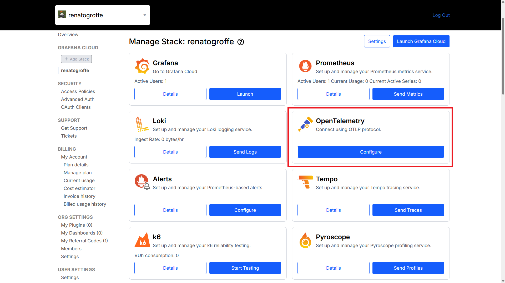
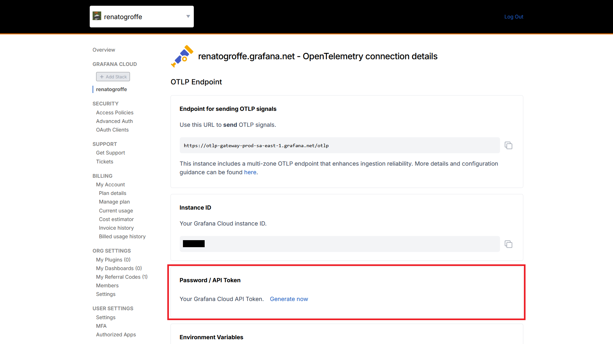
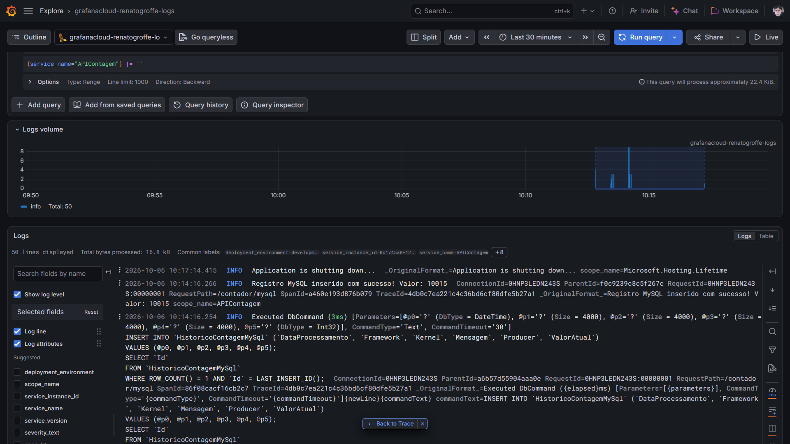
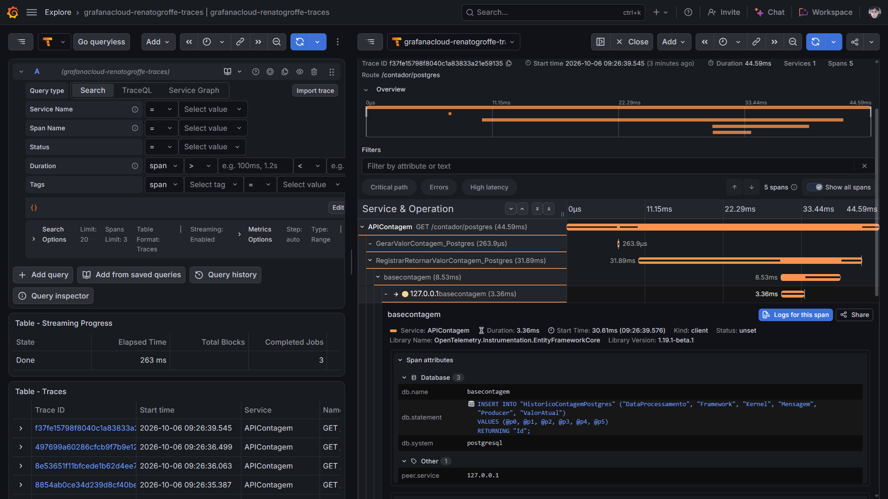
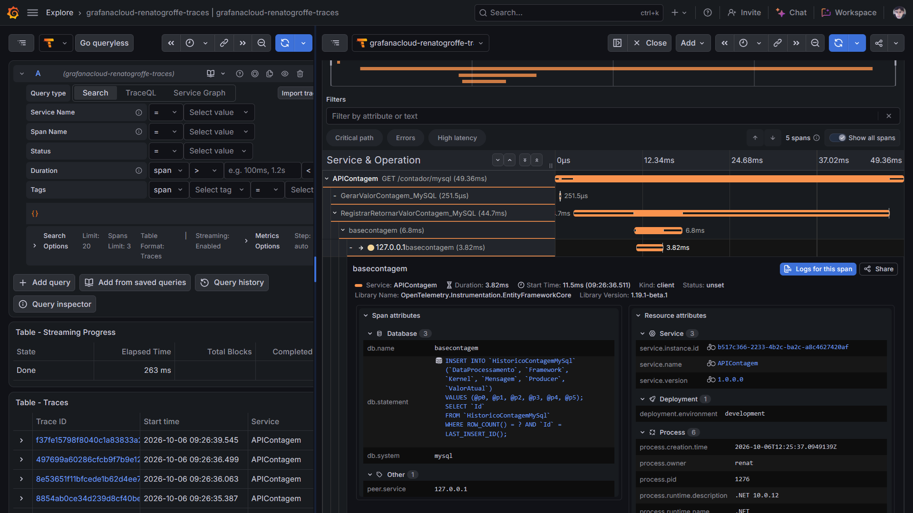

# aspnetcore10-otel-grafanacloud-tempo-loki-postgres-mysql-testcontainers_contagemacessos
Exemplo de uso de OpenTelemetry + Grafana Cloud + Tempo (trace) + Loki (logs) em uma API REST de contagem de acessos baseada em .NET 10 + ASP.NET Core e que utiliza bases de dados PostgreSQL + MySql + Testcontainers.

## Testes

Para integrar esta aplicação com o **Grafana Cloud** deve-se acessar a **opção OpenTelemetry**:

Acessar em **Password / API Token** a opção **Generate now**:

Criando assim um novo token (inserido no appsettings.json para este exemplo):

Logs gerados e exportados para o Grafana Loki:

Trace do Grafana Tempo acessando uma base PostgreSQL:

Trace do Grafana Tempo acessando uma base MySQL:

